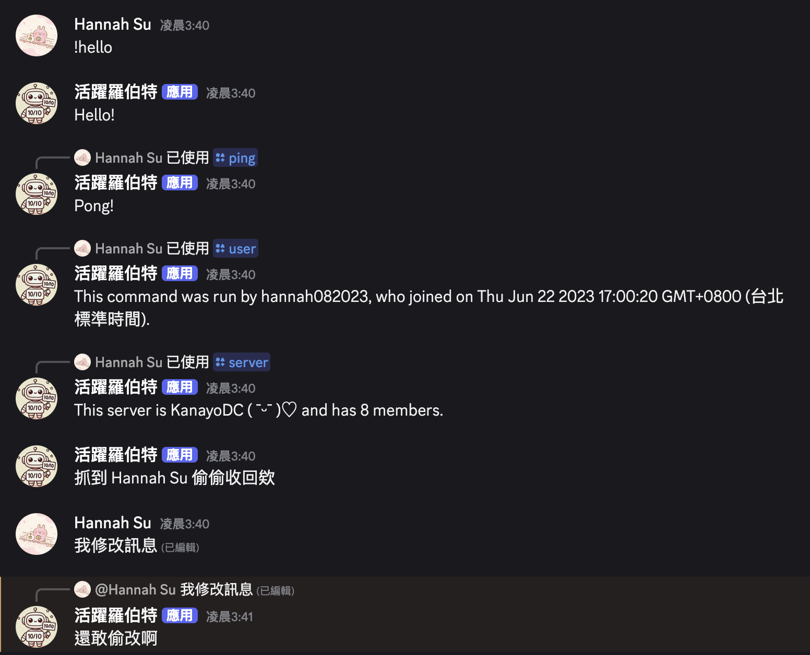

# My First Discord Bot
這是我製作的簡易 Discord Bot 名為活躍羅伯特。

## 主要功能介紹
支援 Slash 指令，並能自動載入 commands 資料夾中的指令模組
### Slash Commands of 活躍羅伯特
* `/ping` 回覆 Pong!
* `/user` 提供使用者的資訊
* `/server` 提供伺服器的資訊

### 簡單文字指令回覆
`!hello` 回覆 Hello!

### 功能測試圖片


### 偵測並回應訊息刪除與修改事件
若收回訊息，活躍羅伯特將傳送「抓到 使用者 偷偷收回欸」
若修改訊息，活躍羅伯特將回覆該訊息「還敢偷改啊」

## 快速開始
1. Clone 專案
```
git clone https://github.com/hannah082023/Discord-Bot.git
cd Discord-Bot
```

2. 安裝所有 `package.json` 中的套件
```npm install```

3. 設定環境變數
建立 .env 檔案，填入以下內容：
```
DISCORD_TOKEN=你的Discord Bot Token
CLIENT_ID=你的應用程式 Client ID
GUILD_ID=目標伺服器 Guild ID
```
請務必將 .env 加入 .gitignore，避免敏感資訊外洩。

4. 執行機器人
```
node index.js
```

## 專案結構
```
Discord-Bot/
├── commands/          # Slash 指令模組資料夾
├── config.js          # 環境變數讀取設定
├── index.js           # 主程式進入點
├── .env               # 環境變數（不建議加入版本庫）
├── package.json       # npm 套件與腳本
└── .gitignore         # Git 忽略檔案設定
```
